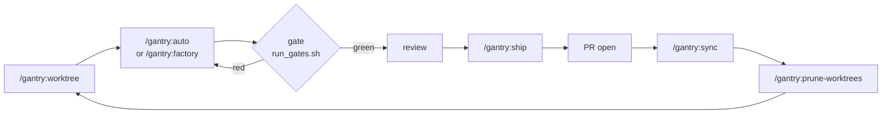

# gantry

**A worktree-to-PR workflow for Claude Code.** Seven skills that take a task from a fresh branch
through planning, implementation, an unskippable gate, review, and a pull request.

The design principle, and the reason this is a plugin rather than a prompt:

> **Model for judgment, script for the guarantee.**

Planning, implementing, and fixing are judgment — the model is good at them. But *"never push if
the checks are red"* is not a promise prose can keep; a model can always talk itself past a
sentence. So that one guarantee lives in a shell script's exit code, and an optional `Stop` hook
enforces it from outside the conversation, where the model cannot decline it.

## Install

```
/plugin marketplace add kostya-epifanov/claude-gantry
/plugin install gantry@claude-gantry
```

Nothing else to configure. Skills, the sub-agent roster, and the readiness hook all ship together.
Requirements: `bash` and `git`. `gh` is optional (without it, `ship` prints the `gh pr create`
command for you to run); `jq` is recommended.

## The loop



In practice most work is one command:

```
/gantry:auto add a dark-mode toggle to settings
```

That creates a worktree and branch, plans, asks you to confirm, implements, runs your repo's
checks as a hard blocker, gets an independent review of the diff, asks once before anything
outward-facing, then commits, pushes, and opens the PR. Add `--autonomous` to drop both
checkpoints and run unattended; add `--no-pr` to stop after the push.

## The skills

| Command | What it does |
|---|---|
| `/gantry:auto` | Task → open PR, in one context. Worktree, plan, implement, gate, review, ship. |
| `/gantry:factory` | The same pipeline, delegated to scoped sub-agents against an on-disk `task.md` contract. |
| `/gantry:ship` | Advance one step toward a merged PR — commit, push, open PR. Idempotent. |
| `/gantry:worktree` | Create a worktree under `.claude/worktrees/` from an up-to-date parent, and enter it. |
| `/gantry:sync` | Return to the base branch and bring it up to date. Refuses on a dirty tree. |
| `/gantry:prune-worktrees` | Review stale or merged worktrees and remove the ones you approve. |
| `/gantry:preserve` | Write a session handoff doc: decisions and why, dead ends, the exact next action. |

Full reference: [docs/SKILLS.md](docs/SKILLS.md). The argument behind the design:
[docs/METHOD.md](docs/METHOD.md). How the pieces fit: [docs/ARCHITECTURE.md](docs/ARCHITECTURE.md).

## The gate

Everything hinges on one script, `run_gates.sh`, whose **exit code is the contract**:

| Exit | Meaning | Consequence |
|---|---|---|
| `0` | green | proceed |
| `1`+ | a check failed | **nothing is pushed** |
| `2` | the gate could not run | stop and report — not a failed check, a broken environment |
| `3` | no checks found, under `--strict` | **stop; refuse to push** |

It resolves what to run in three tiers:

1. **`.claude/gates.sh` in your repo, if present — that file *is* the gate**, and its exit code is
   used verbatim. This is how you reproduce your real CI and override every heuristic.
2. Otherwise it auto-detects checks (JS lint/typecheck/build/test, Dart/Flutter, Python, Cargo,
   Go, a Makefile `test` target) at the repo root **and** in each subproject a bounded scan finds,
   so a monorepo with manifests in subdirectories is covered rather than missed.
3. Otherwise it prints `NO-GATES`.

`NO-GATES` is treated differently by mode on purpose: **supervised** continues but says plainly
that the run had no enforced checks; **autonomous** refuses to push. With nobody watching, code
that ran zero checks must not reach a PR.

Arming it properly takes one file — see [examples/gates.sh](examples/gates.sh).

## The readiness hook

`run_gates.sh` is a rule the orchestrator follows. The hook is what makes it a rule the model
**cannot** skip: registered on `Stop` and `SubagentStop`, it re-runs the gate out of band and
blocks the stop with exit 2 when the tree is red.

**It installs registered but inert.** It fires only when all three hold:

1. `task.md` exists at the repo root, **and**
2. `.claude/gates.sh` exists at the repo root, **and**
3. `task.md`'s frontmatter says exactly `status: implementing`.

None of those appear by accident — **creating `.claude/gates.sh` is the opt-in.** Outside that
window it parses stdin, makes two file tests, and exits 0 with no perceptible delay.

Two things you should know before you install it, both of which the hook documents about itself:

- **It writes to your repo.** Every invocation, fire *or* skip, appends one line to
  `.claude/artifacts/gate-hook.log`, and a fire also writes the gate's full output to
  `.claude/artifacts/gate-<timestamp>-<pid>.log`. Add `.claude/artifacts/` to your `.gitignore`.
- **Its own honest limit.** The trigger is `task.md`'s `status:` — a file the model can write. So
  *"the model cannot bypass the gate"* is approximately, not exactly, true. The mitigation is that
  every invocation is logged, so a bypass is visible after the fact rather than silent.

Turning it off: `export GANTRY_READINESS_GATE=off`.

## Context cost

Skills are not free — a plugin's descriptions sit in every session's context. gantry's do too, and
you can check the number yourself:

```
claude plugin details gantry@claude-gantry
```

At v0.1 that is **~1,157 always-on tokens** for all seven skills and four agents combined. Bodies
are paid only when a skill actually fires.

## Extending it

Skills are plain directories under `skills/`, so adding one is writing a `SKILL.md` and validating
it. See [docs/SKILLS.md](docs/SKILLS.md) and [CONTRIBUTING.md](CONTRIBUTING.md).

## Not included, by design

No task index, no scheduler, no parallel-task admission control. gantry runs **one supervised task
at a time**; `git worktree list` already answers "what's in flight," and a second bookkeeping layer
would need to be kept true. It is thin glue over native primitives — git worktrees, shell exit
codes, and Claude Code's own hook and agent mechanisms — and it is meant to stay that way.

## License

MIT — see [LICENSE](LICENSE).
