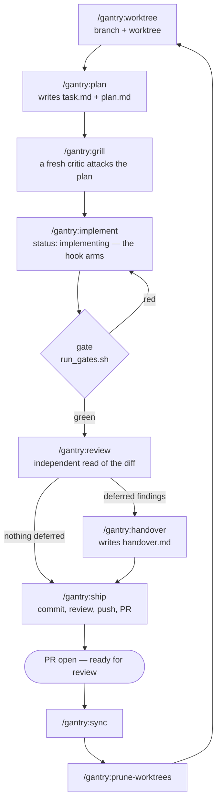
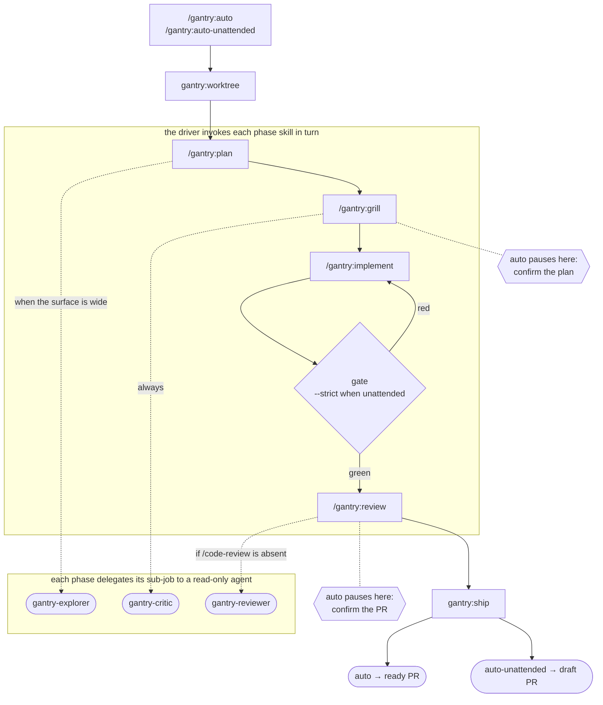

# gantry

**A worktree-to-PR workflow for Claude Code.** Twelve skills that take a task from a fresh branch
through planning, a critique of that plan, implementation, an unskippable gate, review, and a pull
request.

The design principle, and the reason this is a plugin rather than a prompt:

> **Model for judgment, script for the guarantee.**

Planning, implementing, and fixing are judgment — the model is good at them. But *"never push if
the checks are red"* is not a promise prose can keep; a model can always talk itself past a
sentence. So that one guarantee lives in a shell script's exit code, and an optional `Stop` hook
enforces it from outside the conversation, where the model cannot decline it.

## Install

```
/plugin marketplace add kostya-epifanov/claude-gantry
/plugin install gantry@claude-gantry
```

Nothing else to configure. Skills, the sub-agent roster, and the readiness hook all ship together.
Requirements: `bash` and `git`. `gh` is optional (without it, `ship` prints the `gh pr create`
command for you to run); `jq` is recommended.

## The chain

One chain of phases, run three ways. Each phase is its own skill, so you can type them yourself,
have one command drive them, or hand the whole thing over.

### Driving it yourself

Type the phases in order. Stop wherever you like, iterate with Claude without any skill at all,
then pick the chain back up — every phase works out where things stand by reading the repo, not by
remembering the conversation.



### Handing it over

`/gantry:auto` runs the same phases — invoking each phase skill in turn — and pauses twice for you.
`/gantry:auto-unattended` runs them with nobody watching and stops at a draft PR. Delegation happens
inside the phases, where each sub-job gets a read-only agent scoped to it.



So most work is one command:

```
/gantry:auto add a dark-mode toggle to settings
```

That creates a worktree and branch, plans, has a fresh critic attack the plan, asks you to confirm,
implements, runs your repo's checks as a hard blocker, gets an independent review of the diff, asks
once before anything outward-facing, then commits, pushes, and opens the PR. Swap in
`/gantry:auto-unattended` to run it headless to a draft PR; add `--no-pr` to stop after the push.

**The drivers contain no phase logic.** They invoke the same skills you would type. That is what
keeps the three ways of running from drifting into three subtly different pipelines.

## The skills

| Command | What it does |
|---|---|
| `/gantry:auto` | Task → open PR, supervised. Invokes each phase skill in turn; pauses twice. |
| `/gantry:auto-unattended` | The same chain with nobody watching, ending at a **draft** PR. |
| `/gantry:worktree` | Create a worktree under `.claude/worktrees/` from an up-to-date parent, and enter it. |
| `/gantry:plan` | Write the contract and the plan — `task.md` and `plan.md` — asking what needs asking. |
| `/gantry:grill` | Attack the plan with a fresh critic, before being wrong costs an implementation. |
| `/gantry:implement` | Carry out the plan, then prove it with the gate. |
| `/gantry:review` | Independent review of the diff. Read-only; `--fix` applies what's in scope. |
| `/gantry:handover` | Write `handover.md` — what this change deliberately left, and the next action. |
| `/gantry:ship` | Advance one step toward a merged PR — commit, push, open PR. Idempotent. Reviews only with `--review`. |
| `/gantry:sync` | Return to the base branch and bring it up to date. Refuses on a dirty tree. |
| `/gantry:prune-worktrees` | Review stale or merged worktrees and remove the ones you approve. |
| `/gantry:preserve` | Write a session handoff doc: decisions and why, dead ends, the exact next action. |

Full reference: [docs/SKILLS.md](docs/SKILLS.md). The argument behind the design:
[docs/METHOD.md](docs/METHOD.md). How the pieces fit: [docs/ARCHITECTURE.md](docs/ARCHITECTURE.md).

## The artifacts

Three files land at the worktree root and are committed with the branch, so they arrive with the
pull request:

| File | Written by | Answers |
|---|---|---|
| `task.md` | `/gantry:plan` | what this is, when it's done, what it deliberately isn't |
| `plan.md` | `/gantry:plan`, revised by `/gantry:grill` | what the change was supposed to be |
| `handover.md` | `/gantry:handover` | what this change left alone, and why |

They are also how the chain survives you leaving it. `task.md`'s `status:` is the phase marker, and
every skill reads it from disk — so a fresh session, a sub-agent, and a resumed conversation all
reach the same answer about where the work stands.

## The gate

Everything hinges on one script, `run_gates.sh`, whose **exit code is the contract**:

| Exit | Meaning | Consequence |
|---|---|---|
| `0` | green | proceed |
| `1`+ | a check failed | **nothing is pushed** |
| `2` | the gate could not run | stop and report — not a failed check, a broken environment |
| `3` | no checks found, under `--strict` | **stop; refuse to push** |

It resolves what to run in three tiers:

1. **`.claude/gates.sh` in your repo, if present — that file *is* the gate**, and its exit code is
   used verbatim. This is how you reproduce your real CI and override every heuristic.
2. Otherwise it auto-detects checks (JS lint/typecheck/build/test, Dart/Flutter, Python, Cargo,
   Go, a Makefile `test` target) at the repo root **and** in each subproject a bounded scan finds,
   so a monorepo with manifests in subdirectories is covered rather than missed.
3. Otherwise it prints `NO-GATES`.

`NO-GATES` is treated differently by mode on purpose: **supervised** continues but says plainly
that the run had no enforced checks; **unattended** refuses to push. With nobody watching, code
that ran zero checks must not reach a PR.

Arming it properly takes one file — see [examples/gates.sh](examples/gates.sh).

## The readiness hook

`run_gates.sh` is a rule the orchestrator follows. The hook is what makes it a rule the model
**cannot** skip: registered on `Stop` and `SubagentStop`, it re-runs the gate out of band and
blocks the stop with exit 2 when the tree is red.

**It installs registered but inert** — and *registered* is worth being precise about, because it is
the thing people most often check for and get wrong. **Grepping `settings.json` will not find it.**
gantry registers the hook at *plugin* level, in the plugin's own `hooks/hooks.json`, so a search of
your project or user settings finds nothing and proves nothing: it is neither evidence that the
hook is absent nor that it is present. What does settle it is `/plugin`, which shows whether gantry
is installed and enabled.

`.claude/artifacts/gate-hook.log` answers the narrower question of whether the hook *ran* — but
only in a repo that has already opted in. In a repo with both `task.md` and `.claude/gates.sh`,
every invocation appends a line, fire or skip, so an empty log after a stop means the hook did not
run. **Before the opt-in it proves nothing:** the hook tests for those two files first and exits
without creating `.claude/artifacts/` at all, so a missing log there is the designed behaviour of a
registered hook, not evidence of an absent one. That is exactly the repo a reader checking this
usually has.

The same limit applies to `lib/detect_stage.sh`. Its `HOOK:` line reports
`conditions-met`/`conditions-unmet`, which is the *firing conditions* below and nothing more; the
script cannot see registration, which is why the value does not claim to.

It fires only when all three hold:

1. `task.md` exists at the repo root, **and**
2. `.claude/gates.sh` exists at the repo root, **and**
3. `task.md`'s frontmatter says exactly `status: implementing`.

None of those appear by accident — **creating `.claude/gates.sh` is the opt-in.** Outside that
window it parses stdin, makes two file tests, and exits 0 with no perceptible delay.

Since v0.2 every mode writes `task.md`, so the hook arms in all three. In v0.1 only the delegated
pipeline wrote one, which meant the headline skill's gate was never actually enforced — the guard
was real, but nothing had switched it on.

Two things you should know before you install it, both of which the hook documents about itself:

- **It writes to your repo — but only once that repo has opted in.** A repo with no `task.md` or no
  `.claude/gates.sh` is left completely alone: no directory, no log line, nothing. Once both exist,
  every invocation appends one line to `.claude/artifacts/gate-hook.log`, and a fire writes two —
  one when the gate starts and one when it ends — plus the gate's full output to
  `.claude/artifacts/gate-<timestamp>-<pid>.log`. Add `.claude/artifacts/` to your `.gitignore`.
- **Its own honest limit.** The trigger is `task.md`'s `status:` — a file the model can write. So
  *"the model cannot bypass the gate"* is approximately, not exactly, true. The mitigation is that
  every invocation in an armed repo is logged, so a bypass is visible after the fact rather than
  silent. A start line with no matching outcome is the signature of the one remaining hole: a gate
  that hung until the harness killed the hook, letting the stop through un-gated.

Turning it off: `export GANTRY_READINESS_GATE=off`.

## Context cost

Skills are not free — a plugin's descriptions sit in every session's context. gantry's do too, and
you can check the number yourself:

```
claude plugin details gantry@claude-gantry
```

v0.3 measures **~1,464 always-on tokens** for twelve skills and three agents. v0.1 measured
~1,157 for seven skills and four agents; the growth is the five phase skills, less the ~70 saved by
deleting an agent nothing dispatched.

Unlike v0.2's, that figure is measured rather than derived — a project whose whole argument is that
a number beats a paragraph should not publish its most-quoted number as a paragraph. And it is
enforced rather than merely recorded: `scripts/context_budget.sh` fails the build if the
descriptions grow past a declared ceiling, so this section cannot quietly go stale the way the
derived one did.

The phase skills carry deliberately short descriptions, because the drivers and the standalone
skills are what you actually invoke by name. Bodies are paid only when a skill fires.

## Extending it

Skills are plain directories under `skills/`, so adding one is writing a `SKILL.md` and validating
it. See [docs/SKILLS.md](docs/SKILLS.md) and [CONTRIBUTING.md](CONTRIBUTING.md).

## Not included, by design

No task index, no scheduler, no parallel-task admission control. gantry runs **one supervised task
at a time**; `git worktree list` already answers "what's in flight," and a second bookkeeping layer
would need to be kept true. It is thin glue over native primitives — git worktrees, shell exit
codes, and Claude Code's own hook and agent mechanisms — and it is meant to stay that way.

## License

MIT — see [LICENSE](LICENSE).
