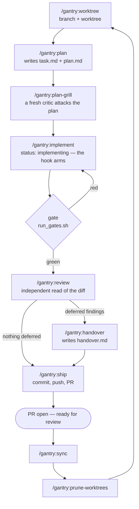

# gantry

[](https://github.com/kostya-epifanov/claude-gantry/releases)

**Your agent says the tests pass. gantry runs them anyway, and won't let it finish until they do.**

A worktree-to-PR workflow for Claude Code: thirteen skills that take a task from a fresh branch
through a plan, a critique of that plan, implementation, a gate, an independent review, and a pull
request. Then it merges the pull requests that piled up into one whose combined tree still passes.

The design principle, and the reason this is a plugin rather than a prompt:

> **Model for judgment, script for the guarantee.**

Planning, implementing and fixing are judgment, and the model is good at them. *"Never push if the
checks are red"* is not a promise prose can keep; a model can always talk itself past a sentence.
So that one rule lives in a shell script's exit code, and a `Stop` hook re-runs the script from
outside the conversation, where the model cannot decline it.

<!-- DEMO: 30–60s recording: /gantry:auto on a real repo → gate goes red → agent fixes → gate green → PR opens
     Once docs/assets/demo.gif exists, replace this comment with:
     
-->

## Install

```
/plugin marketplace add kostya-epifanov/claude-gantry
/plugin install gantry@claude-gantry
```

Requirements: `bash` and `git`. `gh` is optional (without it, `ship` prints the `gh pr create`
command for you); `jq` is recommended. Skills, agents and the hook ship together.

## Quickstart

1. Install, as above.
2. Copy [examples/gates.sh](examples/gates.sh) to `.claude/gates.sh` in your repo and put your
   real checks in it. That file *is* the gate, its exit code is used verbatim, and creating it is
   the opt-in that arms the hook.
3. Give it a small task:

   ```
   /gantry:auto add a dark-mode toggle to settings
   ```

4. It pauses twice. **After the plan has been grilled** it shows the plan, what the critique
   changed, and the branch and worktree it created, and asks whether to proceed. **After the
   review**, with the gate green, it asks once more before it commits, pushes, and opens the PR.
   A genuine design fork in the plan is put to you as well, before any code is written.
5. The PR opens ready for review, its body quoting the contract the change was built against and
   anything the review deliberately left out.

Without `.claude/gates.sh`, gantry auto-detects checks (JS, Dart/Flutter, Python, Cargo, Go, a
Makefile `test` target). If it finds none, a supervised run continues and says so; an unattended
run refuses to push.

## The chain

One chain of phases, three ways to run it: type each phase yourself, let `/gantry:auto` drive them
with two pauses, or hand the whole thing to `/gantry:auto-unattended` and get a draft PR. Every
phase works out where things stand by reading the repo, not the conversation, so you can stop,
iterate by hand, and pick the chain back up.


```mermaid
flowchart TD
  W["/gantry:worktree<br/>branch + worktree"] --> P["/gantry:plan<br/>writes task.md + plan.md"]
  P --> G["/gantry:plan-grill<br/>a fresh critic attacks the plan"]
  G --> I["/gantry:implement<br/>status: implementing — the hook arms"]
  I --> GATE{"gate<br/>run_gates.sh"}
  GATE -- "red" --> I
  GATE -- "green" --> R["/gantry:review<br/>independent read of the diff"]
  R -- "deferred findings" --> H["/gantry:handover<br/>writes handover.md"]
  R -- "nothing deferred" --> S["/gantry:ship<br/>commit, push, PR"]
  H --> S
  S --> PR(["PR open — ready for review"])
  PR --> SY["/gantry:sync"]
  SY --> PW["/gantry:prune-worktrees"]
  PW --> W
```

**The drivers contain no phase logic.** They invoke the same skills you would type, so the three
ways of running cannot drift into three pipelines. Delegation happens inside the phases, to agents
that are read-only by tool list: `plan` may dispatch an explorer, `plan-grill` always dispatches a
fresh critic, `review` dispatches an independent reviewer. Who dispatches whom, as a diagram:
[docs/ARCHITECTURE.md](docs/ARCHITECTURE.md#skills-carry-the-procedure-agents-carry-the-boundary).

Run several lanes and you get several pull requests, each checked only on its own.
`/gantry:integrate` merges the ready ones into one integration branch, one PR at a time, resolving
conflicts from what each PR is *for* and running your checks after every merge.

## The skills

| Command | What it does |
|---|---|
| `/gantry:auto` | Task → open PR, supervised. Invokes each phase skill in turn; pauses twice. |
| `/gantry:auto-unattended` | The same chain with nobody watching, ending at a **draft** PR. |
| `/gantry:worktree` | Create a worktree under `.claude/worktrees/` from an up-to-date parent, and enter it. |
| `/gantry:plan` | Write the contract and the plan — `task.md` and `plan.md` — asking what needs asking. |
| `/gantry:plan-grill` | Attack the plan with a fresh critic, before being wrong costs an implementation. |
| `/gantry:implement` | Carry out the plan, then prove it with the gate. |
| `/gantry:review` | Independent review of the diff. Read-only; `--fix` applies what's in scope. |
| `/gantry:handover` | Write `handover.md` — what this change deliberately left, and the next action. |
| `/gantry:ship` | Advance one step toward a merged PR — commit, push, open PR. Idempotent. Reviews only with `--review`. |
| `/gantry:integrate` | Merge the ready open PRs one at a time into one integration PR, checking the combined tree after each. |
| `/gantry:sync` | Return to the base branch and bring it up to date. Refuses on a dirty tree. |
| `/gantry:prune-worktrees` | Review stale or merged worktrees and remove the ones you approve. |
| `/gantry:preserve` | Write a session handoff doc: decisions and why, dead ends, the exact next action. |

Full reference: [docs/SKILLS.md](docs/SKILLS.md). The argument behind the design:
[docs/METHOD.md](docs/METHOD.md). How the pieces fit: [docs/ARCHITECTURE.md](docs/ARCHITECTURE.md).
How the agents are scored rather than argued about: [docs/EVALS.md](docs/EVALS.md).

## The gate

Everything hinges on one script, `lib/run_gates.sh`, whose **exit code is the contract**:

| Exit | Meaning | Consequence |
|---|---|---|
| `0` | green | proceed |
| `1`+ | a check failed | **nothing is pushed** |
| `2` | the gate could not run | stop and report — not a failed check, a broken environment |
| `3` | no checks found, under `--strict` | **stop; refuse to push** |

Three tiers decide what runs. **`.claude/gates.sh` in your repo, if present, is the gate**; this is
how you reproduce your real CI. Otherwise auto-detected checks, at the repo root and in each
subproject a bounded scan finds. Otherwise `NO-GATES`: a supervised run passes and says nothing was
enforced; an unattended run (`--strict`) refuses.

## The readiness hook

The gate script is a rule the chain follows. The hook makes it a rule the model **cannot** skip.
Registered on `Stop` and `SubagentStop`, it re-runs the gate out of band when the model tries to
end its turn, and blocks the stop while the tree is red.

It installs registered but inert, and fires only when all three hold:

1. `task.md` exists at the repo root, **and**
2. `.claude/gates.sh` exists at the repo root, **and**
3. `task.md`'s frontmatter says exactly `status: implementing`.

None of those appear by accident. **Creating `.claude/gates.sh` is the opt-in.** Outside that
window the hook makes two file tests and exits 0, touching nothing.

**Its honest limit.** The trigger is `task.md`'s `status:`, a file the model can write, so *"the
model cannot bypass the gate"* is approximately, not exactly, true. The mitigation is that every
invocation in an armed repo is logged to `.claude/artifacts/gate-hook.log`, so a bypass is visible
after the fact rather than silent.

Turn it off with `export GANTRY_READINESS_GATE=off`. What it writes, how to tell whether it is
registered and whether it ran, and how it got here: [docs/HOOK.md](docs/HOOK.md).

## When to use gantry, and when not

Use it when you want an agent to take a task all the way to a pull request, with "did the checks
pass" answered by an exit code rather than by the agent. Against prompt-only skill packs and
session managers, three things set it apart:

- **The gate is enforced by a script and a hook outside the conversation**, not by instructions.
  A rule in a prompt is weighed against everything else in context; a hook's exit code is not.
- **`integrate` checks the combined tree.** Several green PRs from parallel lanes say nothing
  about how they merge. One integration PR, gated after every merge, does.
- **It is thin glue over native primitives.** git worktrees, shell exit codes, and Claude Code's
  own hook and agent mechanisms. No daemon, no database, no bookkeeping to keep true against git.

It is the wrong tool if you want any of these, all left out by design:

- **A task index, a scheduler, or parallel-task admission control.** gantry runs one supervised
  task at a time; `git worktree list` already answers "what's in flight".
- **An agent that merges.** Every skill stops at an open PR.
- **Unattended runs that settle design decisions.** An open fork stops an unattended run.
- **A guarantee for a repo with no checks.** The gate enforces what your checks establish.

## The artifacts

Three files land at the worktree root and are **not committed**: they are the run's working state,
not the change. `/gantry:ship` quotes what a reviewer needs from them into the PR body.

| File | Written by | Answers |
|---|---|---|
| `task.md` | `/gantry:plan` | what this is, when it's done, what it deliberately isn't |
| `plan.md` | `/gantry:plan`, revised by `/gantry:plan-grill` | what the change was supposed to be |
| `handover.md` | `/gantry:handover` | what this change left alone, and why |

`task.md`'s `status:` is the phase marker every skill reads from disk, so a fresh session, a
sub-agent and a resumed conversation agree on where the work stands. The exclusion goes in
`.git/info/exclude`, never in a tracked file of yours. Upgrading from 0.4.x, which committed these
files? See the [0.5.0 changelog entry](CHANGELOG.md#050).

## Context cost

Skill descriptions sit in every session's context. gantry's come to about **2,124 always-on
tokens** for thirteen skills and three agents. Check it yourself, and trust that over this figure:

```
claude plugin details gantry@claude-gantry
```

`scripts/context_budget.sh` fails the build if the descriptions outgrow a declared ceiling. How it
was measured, and why older figures do not compare: [docs/SKILLS.md](docs/SKILLS.md#context-cost).

## Extending it

Skills are plain directories under `skills/`, so adding one is writing a `SKILL.md` and validating
it. See [docs/SKILLS.md](docs/SKILLS.md) and [CONTRIBUTING.md](CONTRIBUTING.md).

## License

MIT — see [LICENSE](LICENSE).
