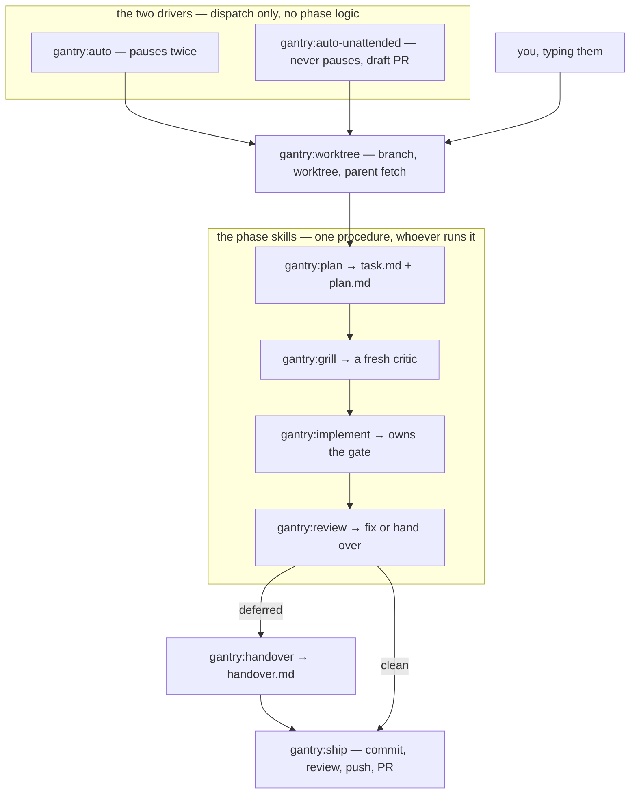
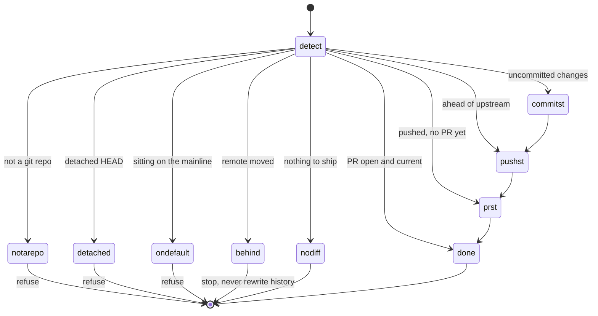

# Architecture

How the pieces fit. For *why* they are shaped this way, see [METHOD.md](METHOD.md); for per-skill
detail, [SKILLS.md](SKILLS.md).

## Component map

Everything is auto-discovered from the plugin root — no path declarations in `plugin.json`.

```
gantry/
├── .claude-plugin/
│   ├── plugin.json          name: gantry  → the /gantry: namespace
│   └── marketplace.json     name: claude-gantry, one plugin, source "./"
├── skills/<name>/SKILL.md   → /gantry:<name>          (12)
│   ├── references/          long-form detail, read on demand
│   ├── scripts/             skill-local deterministic work, run not read
│   └── templates/           the task.md fallback
├── lib/                     shared runtime scripts     (5)
│   ├── run_gates.sh         the one hard gate
│   ├── gate_coverage.sh     what the gate actually read — reported, never enforced
│   ├── detect_stage.sh      where a task sits on the chain
│   ├── journal_append.sh    argv → one journal.jsonl line
│   └── ensure_excluded.sh   idempotent, race-free .git/info/exclude writes
├── agents/gantry-*.md       → the delegation roster    (4)
├── hooks/hooks.json         → Stop + SubagentStop      (2)
└── examples/gates.sh        a starter repo-owned gate
```

`lib/` exists because these scripts are shared by several skills *and* by the hook. Putting the
gate under the skill that happened to run it first (`skills/auto/scripts/`, as in v0.1) made the
path a lie as soon as ownership moved.

`gate_coverage.sh` sits beside the gate rather than inside it, and the split is the point.
`run_gates.sh` emits *where* its checks ran; `gate_coverage.sh` compares that against the changed
paths and returns a verdict. Only the caller holds both the verdict and the exit code, so only
the caller can name **green-but-uncovered** — a gate that passed while reading none of the paths
the diff touched. The comparison is a **heuristic** (a root is the directory a check ran in, not
the files it read) and is therefore reported and never enforced: it changes no exit code and adds
no refusal.

`journal_append.sh` and `ensure_excluded.sh` exist for a narrower reason: a worktree-isolated
session refuses a command it cannot verify stays inside the worktree — no substitutions, no
compound structure — so an orchestrator cannot build a JSON line or do a read-then-append in its
own argv. Moving that into a script is the only way to keep the caller's command flat. Neither is
a framework; all five are argv-in, contract-out.

A skill body enters the conversation when it fires and **stays there for the rest of the session**.
That is why detail lives in `references/` (loaded only when the skill says to read it) and why
deterministic work lives in `scripts/` (run, never pasted). The always-on cost is roughly the
frontmatter `description` of each skill; `claude plugin details gantry@claude-gantry` prints both
columns.

## Who invokes whom

There is **one** chain of phases, and three ways to run it. The drivers do not contain a pipeline;
they dispatch the same phase skills a human would type.



The **drivers** own three things and nothing else: which mode is running, when to pause, and which
phase skill runs next. Everything a phase actually *does* lives in the phase skill, which is why the
three ways of running cannot drift into three pipelines.

`sync` closes the loop the other way: it returns you to the base branch, then hands off to
`prune-worktrees` to remove the lanes the merge just made redundant. `preserve` sits outside the
pipeline entirely — it records the conversation, not the repo.

## Skills carry the procedure, agents carry the boundary

The roster and the phase skills answer different questions, and keeping them separate is what makes
delegation trustworthy:

- **A skill says what to do.** One body, read identically whether a human typed the command or a
  sub-agent was told to invoke it.
- **An agent says what the runner is *able* to do.** `gantry-explorer` cannot write because it has
  no `Write` tool. `gantry-reviewer` cannot commit for the same reason. No prompt overrides that.

So a driver **invokes** `/gantry:plan` — rather than restating the planning procedure into a
prompt, which is how two copies of a procedure start disagreeing. Delegation happens one level
down, inside the phase, where the sub-job is narrow enough for a tool boundary to mean something:
`plan` dispatches the explorer when the surface warrants it, `grill` always dispatches a fresh
critic, `review` dispatches an independent reviewer.

**That split is what lets every shipped agent be read-only.** A phase has to write — `task.md`,
`plan.md`, the code itself — so wrapping a phase in an agent means either a writable agent (the
boundary is gone) or a phase that cannot do its job. Keeping the phases in the caller's context and
the agents on the sub-jobs gets both: the writing is visible where it happens, and every roster
agent is one a prompt cannot talk into changing the tree.

One consequence worth stating, because it is easy to get backwards: a skill's `allowed-tools`
**restricts** what is permitted while the skill is active — it does not grant. A driver therefore
carries `Agent` not because it dispatches phases, but because the phases it invokes dispatch their
own agents, and a tool the driver has not allowed is one the phase cannot reach.

## ship is a stage machine

`ship` is idempotent because it does not track where it is; it **detects** where it is, every
time. `scripts/detect_state.sh` is read-only and emits a single `STAGE:` line; the skill acts on
that and falls through the rest without re-detecting.



Running `/gantry:ship` twice is safe: the second run detects `done` and reports. Three states are
hard refusals — the repo's default branch, a detached HEAD, and a diverged branch. gantry never
rewrites remote history on your behalf.

**The review stage is not on this diagram, on purpose.** Every node above stands for a value
`detect_state.sh` can emit — the node *ids* are mermaid-safe spellings, so `commitst`, `pushst` and
`prst` are the states the script reports as `commit`, `push` and `pr` (likewise `notarepo`,
`ondefault` and `nodiff` for `not-a-repo`, `on-default` and `no-diff`). `review` is not among them:
it is not an entry point, it runs on the way through from `commit`, `push`, or `pr`, and it is
skipped entirely by `--no-pr` or `--reviewed`. Drawing it in would claim a `STAGE` that does not exist. What it does change is the
fall-through rule above it: the review stage can create a commit, so the skill **re-detects** after
it rather than deciding the push from the original read. It is also the one case where a re-run is
not free — ship records nothing, so a run that stops between the review and the PR (`gh` missing,
say) should be resumed with `--reviewed`.

## The artifact contract

Every mode writes artifacts at the **worktree root** — not just the delegated one, as in v0.1. Who
owns each, and whether it is committed, is the whole protocol:

| Artifact | Written by | Committed | Why |
|---|---|---|---|
| `task.md` | `gantry:plan` (Affected areas pasted from the explorer) | **yes** | it is the contract a reviewer reads the PR against |
| `plan.md` | `gantry:plan`, revised by `gantry:grill` | **yes** | the thing a human skims before implementation starts |
| `handover.md` | `gantry:handover`, when review defers something | **yes** | what this change deliberately left, and the next action |
| `journal.jsonl` | `gantry:auto-unattended`, append-only | no — `.git/info/exclude` | a run artifact, not a deliverable |
| gate logs | the gate script | no — same exclusion | evidence, kept out of the diff |

These files are also the chain's memory. `task.md`'s `status:` is the phase marker, and
`lib/detect_stage.sh` is the single reader of it — so a fresh session, a sub-agent, and a
conversation you dropped out of and came back to all resolve the same phase. **No phase skill may
infer where it is from the conversation**, because in two of the three modes there isn't one.

That the artifacts now exist in every mode is what fixed the v0.1 hole where the readiness hook —
which arms on `task.md` — could never fire under `gantry:auto`.

`task.md` is filled in **two passes**, and the split is between what the task settles and what only
the code can. First, *before any code is read*: frontmatter, goal, acceptance criteria,
how-to-verify and the open questions. Writing the intent first is what stops the plan from quietly
redefining the task to match what the code turned out to make easy.

Then, after the code study: *Out of scope* **and** *Affected areas*, together. Out of scope moved
into the second pass because it is the section that most needs code knowledge — what a change
touches is exactly what tells you what it deliberately will not touch — and it is load-bearing
downstream, where `gantry:review` triages findings against it and `gantry:handover` quotes it. A
boundary written from the task description alone is a guess that later phases read as a decision.

Its `status` field is the chain's state machine:

```
planning → planned → grilled → implementing → implemented → reviewed → shipped
    ↓                                ↓
 blocked                          blocked
```

`planning → blocked` is the open-fork stop: `plan` and `grill` will not advance a task whose
*Open questions* still holds an undecided fork, and an unattended run journals an `escalation` and
blocks there rather than guessing at the answer. A supervised run resolves the fork with the user
instead and continues, so it never reaches that edge.

**The readiness hook arms on exactly one of those values, `implementing`, and ignores the rest.**
That narrowness is deliberate: the hook must not fire while planning is still under way, and
widening the matcher is the easiest way to make it fire constantly and get switched off. The extra
v0.2 values are additive — the hook's condition is unchanged from v0.1, and `lib/detect_stage.sh`
reuses the hook's own frontmatter parser byte for byte so the two cannot disagree about what
`status:` says. `scripts/verify.sh` diffs the two copies to keep that true.

## The readiness hook

Three things about it are easy to get wrong:

1. **Loop termination is `stop_hook_active`, and nothing else.** The harness sets it true on a stop
   that was itself caused by a previous block. The hook defers unconditionally when it is true — or
   when parsing it fails, which is treated the same as true. That single field is the entire reason
   the hook cannot loop, and there is deliberately no counter anywhere in the file.
2. **Only exit 2 blocks a `Stop` hook.** Exit 0 is success; exit 1 is a non-blocking *hook error*
   that fails open. That is why the script uses `set -uo pipefail` and never `set -e`: under `-e`
   an unexpected failure would exit 1 and silently wave the stop through. Every exit in the file is
   0 or 2, on purpose.
3. **A gate exit of 2 is red here, not "unrunnable."** The inline call in `gantry:implement` treats
   exit 2 as a broken environment that must not consume a fix attempt. The hook does not carry that
   exemption — from where it stands, a gate that could not run has not proved the tree good, and an
   unproved tree does not stop. This asymmetry is intentional; an earlier version that "helpfully"
   classified exit 2 as unrunnable would have waved a broken environment through forever.

## Gate resolution

```
.claude/gates.sh at repo root?  ──yes──▶  it IS the gate; its exit code is the result
                                          (a 2 or 3 from it is reported as 1 —
                                           those two codes are run_gates.sh's own)
          │ no
          ▼
auto-detect per ecosystem, at the repo root AND in each
subproject a bounded depth-limited scan finds
(JS · Dart/Flutter · Python · Cargo · Go · Makefile test)
          │ nothing found
          ▼
print NO-GATES  ──▶ exit 0, or exit 3 under --strict
```

The subproject scan is why a monorepo with `app/pubspec.yaml` and `landing/package.json` is covered
rather than silently green. The scan prunes `node_modules`, `build`, `.dart_tool` and friends.

## The agent roster

Four agents ship, and **every one of them is read-only**. The tool list is the boundary — not an
instruction in the body, a property of the agent. An explorer that has no `Write` tool cannot write,
however it is prompted.

| Agent | Tools | Model | Dispatched by | Role |
|---|---|---|---|---|
| `gantry-explorer` | Read, Grep, Glob | haiku | `gantry:plan`, when the surface is unfamiliar or wide | read-only scout; produces the text for `task.md`'s Affected areas. Physically cannot write it. |
| `gantry-critic` | Read, Grep, Glob | opus | `gantry:grill`, always | attacks a plan it did not write. Given no planning context, on purpose. Returns findings; the phase triages and revises. |
| `gantry-reviewer` | Read, Grep, Glob, Bash | opus | `gantry:review`, when `/code-review` is unavailable | reads a diff it did not write. Writes nothing — `Bash` is for reading. |

There is deliberately no planner or implementer agent. Writing is what those phases *are*, so an
agent around one is either writable — and then the roster's guarantee is prose again — or unable to
do the job. v0.2 resolved that by keeping the phases in the caller's context and scoping the agents
to the sub-jobs that genuinely only need to read.

**Resolution is per role, repo first**, and the *phase* does it. If the target repo defines
`.claude/agents/<role>.md`, the phase dispatches that; otherwise `gantry-<role>`. A repo that has
tuned one agent to its codebase overrides that one and inherits the rest.

**There is deliberately no verifier agent either.** v0.1 and v0.2 shipped a `gantry-verifier` that
nothing dispatched, defended as available to callers who wanted a scoped read-only check-runner,
with wiring it in recorded as an open question. v0.3 deletes it, because the method had already
settled the question: the gate is a script precisely so that "did it pass" is an exit code rather
than a model's judgment, and an agent that cannot be wired in without contradicting that is not an
open question — it is ~70 always-on tokens per session, in every session, for a component with no
caller.

## Why no skill is model-gated

Claude Code lets a skill set `disable-model-invocation`, keeping its description out of every
session's listing — a real context saving. No gantry skill uses it.

The reason is that a gated skill cannot be invoked *by an agent at all* — only by a human typing
the command. The drivers invoke every phase skill, plus `worktree` and `ship`. Gating any of them
would make the pipeline undelegatable, and an orchestrator that cannot orchestrate is not worth the
tokens it saves. The cost is paid knowingly: roughly the description of each skill, in every
session.

## The one external hook

`sync` resolves the base branch from, in order: an explicit argument, then an **optional external
profile resolver**, then `ship`'s own detection.

The middle tier is the only place gantry reaches outside itself, and it is a **contract, not a
dependency**: gantry ships no resolver and requires none. Absence is the normal case and is never a
warning — the lookup is skipped entirely and detection takes over. It exists for teams that already
keep the base branch in some registry of their own and would rather gantry read it than guess.

To wire yours in, put an executable named `gantry-profile` on `PATH` supporting:

```bash
gantry-profile <project> BASE_BRANCH     # value on stdout
gantry-profile --task-project <task.md>  # resolve the project from frontmatter
```

with exit codes `0` found · `1` known project, field empty · `2` usage/broken · `3` no such
project. The distinction between 1 and 3 matters: both are silent-normal, but only 2 is worth
mentioning in the report.

The project name comes from `$GANTRY_PROJECT` when you set it, otherwise from the second call
above. An empty project name short-circuits the lookup entirely — it is not an error case, and
forcing it through would produce a broken-profile-looking failure for a repo that simply has no
profile.

## Why the unattended runner isn't a Workflow

Claude Code's Workflow tool is, on paper, the right substrate for `gantry:auto-unattended`: a
deterministic orchestration script with `pipeline()`, `parallel()`, and resume-from-cache. Plugins
can ship a `workflows/` directory, and a headless `claude -p` run does wait for a background
workflow rather than exiting under it. It was considered and rejected for v0.2 on two grounds:

- **It is plan-gated.** Workflows need a recent Claude Code and a paid plan, and on some plans must
  be switched on explicitly. gantry is a published plugin; a headline mode that silently fails for a
  share of installs is worse than a plainer one that always works.
- **Hook firing inside a workflow is unverified.** Nothing documents whether `Stop` /
  `SubagentStop` hooks fire for workflow-spawned agents. If they do not, the unattended mode loses
  the unskippable gate — in precisely the mode where nobody is watching. That property is the whole
  point of the plugin and cannot ship on an inference.

So the runner stays on Agent-tool dispatch with on-disk artifacts, which is portable and whose hook
behaviour is observable. Revisit it as an **opt-in second runner**, not a replacement, once two
things have been tested live: whether `agent()` resolves a plugin's own roster agents by name, and
whether `SubagentStop` fires inside a workflow.
