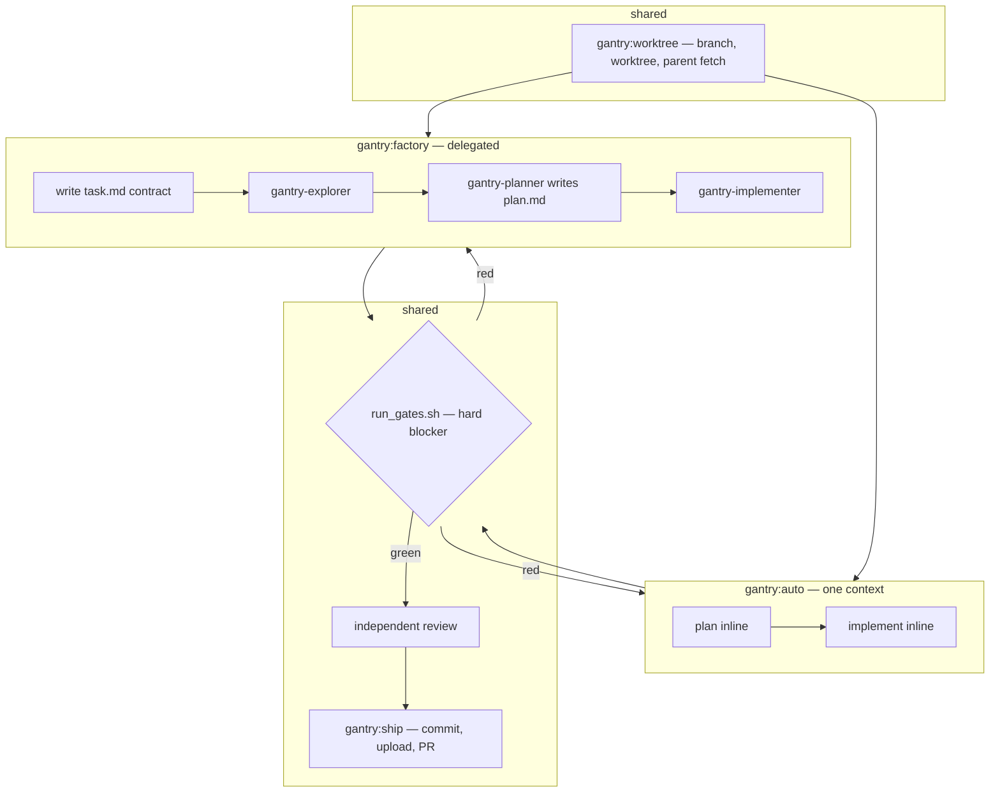
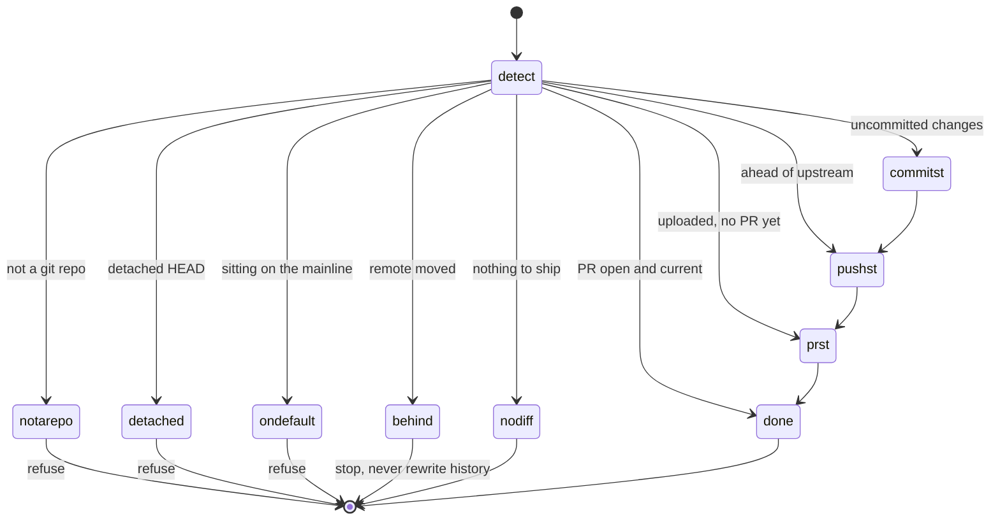

# Architecture

How the pieces fit. For *why* they are shaped this way, see [METHOD.md](METHOD.md); for per-skill
detail, [SKILLS.md](SKILLS.md).

## Component map

Everything is auto-discovered from the plugin root — no path declarations in `plugin.json`.

```
gantry/
├── .claude-plugin/
│   ├── plugin.json          name: gantry  → the /gantry: namespace
│   └── marketplace.json     name: claude-gantry, one plugin, source "./"
├── skills/<name>/SKILL.md   → /gantry:<name>          (9)
│   ├── references/          long-form detail, read on demand
│   ├── scripts/             deterministic work, run not read
│   └── templates/           the task.md fallback
├── agents/gantry-*.md       → the delegation roster    (4)
├── hooks/hooks.json         → Stop + SubagentStop      (2)
└── examples/gates.sh        a starter repo-owned gate
```

A skill body enters the conversation when it fires and **stays there for the rest of the session**.
That is why detail lives in `references/` (loaded only when the skill says to read it) and why
deterministic work lives in `scripts/` (run, never pasted). The always-on cost is roughly the
frontmatter `description` of each skill; `claude plugin details gantry@claude-gantry` prints both
columns.

## Who invokes whom

Two entry points share one spine. `auto` and `factory` differ only in the middle — who does the
exploring, planning, and implementing — and both delegate the ends to the same two skills rather
than reimplementing them.



`sync` closes the loop the other way: it returns you to the base branch, then hands off to
`prune-worktrees` to remove the lanes the merge just made redundant. `status` and `preserve` sit
outside the pipeline entirely — one reports, one records.

## ship is a stage machine

`ship` is idempotent because it does not track where it is; it **detects** where it is, every
time. `scripts/detect_state.sh` is read-only and emits a single `STAGE:` line; the skill acts on
that and falls through the rest without re-detecting.



Running `/gantry:ship` twice is safe: the second run detects `done` and reports. Three states are
hard refusals — the repo's default branch, a detached HEAD, and a diverged branch. gantry never
rewrites remote history on your behalf.

## The artifact contract

`factory` writes four artifacts, all at the **worktree root**. Who owns each, and whether it is
committed, is the whole protocol:

| Artifact | Written by | Committed | Why |
|---|---|---|---|
| `task.md` | the orchestrator (Affected areas pasted from the explorer) | **yes** | it is the contract a reviewer reads the PR against |
| `plan.md` | the **planner** sub-agent, and only it | **yes** | the thing a human skims before implementation starts |
| `journal.jsonl` | the orchestrator, append-only | no — `.git/info/exclude` | a run artifact, not a deliverable |
| gate logs | the gate script | no — same exclusion | evidence, kept out of the diff |

`task.md` is filled in **two passes**: frontmatter, goal, acceptance criteria, how-to-verify and
out-of-scope *before any code is read*; Affected areas after the explorer returns. Writing the
contract first is what stops the plan from quietly redefining the task.

Its `status` field is a state machine — `draft` → `planned` → `implementing` → `blocked` or
`shipped` — and it is also what arms the readiness hook.

## The readiness hook

Three things about it are easy to get wrong:

1. **Loop termination is `stop_hook_active`, and nothing else.** The harness sets it true on a stop
   that was itself caused by a previous block. The hook defers unconditionally when it is true — or
   when parsing it fails, which is treated the same as true. That single field is the entire reason
   the hook cannot loop, and there is deliberately no counter anywhere in the file.
2. **Only exit 2 blocks a `Stop` hook.** Exit 0 is success; exit 1 is a non-blocking *hook error*
   that fails open. That is why the script uses `set -uo pipefail` and never `set -e`: under `-e`
   an unexpected failure would exit 1 and silently wave the stop through. Every exit in the file is
   0 or 2, on purpose.
3. **A gate exit of 2 is red here, not "unrunnable."** The inline call in `auto`/`factory` treats
   exit 2 as a broken environment that must not consume a fix attempt. The hook does not carry that
   exemption — from where it stands, a gate that could not run has not proved the tree good, and an
   unproved tree does not stop. This asymmetry is intentional; an earlier version that "helpfully"
   classified exit 2 as unrunnable would have waved a broken environment through forever.

## Gate resolution

```
.claude/gates.sh at repo root?  ──yes──▶  it IS the gate; exit code used verbatim
          │ no
          ▼
auto-detect per ecosystem, at the repo root AND in each
subproject a bounded depth-limited scan finds
(JS · Dart/Flutter · Python · Cargo · Go · Makefile test)
          │ nothing found
          ▼
print NO-GATES  ──▶ exit 0, or exit 3 under --strict
```

The subproject scan is why a monorepo with `app/pubspec.yaml` and `landing/package.json` is covered
rather than silently green. The scan prunes `node_modules`, `build`, `.dart_tool` and friends.

## The agent roster

Four agents ship. **The tool list is the boundary** — not an instruction in the body, a property of
the agent. An explorer that has no `Write` tool cannot write, however it is prompted.

| Agent | Tools | Model | Role |
|---|---|---|---|
| `gantry-explorer` | Read, Grep, Glob | haiku | read-only scout; produces the text for `task.md`'s Affected areas. Physically cannot write it. |
| `gantry-planner` | Read, Grep, Glob, Write | opus | writes `plan.md` and only `plan.md`. Returns the path and a rationale, never the plan body. |
| `gantry-implementer` | Read, Write, Edit, Bash | sonnet | executes the approved plan; reports mismatches rather than improvising. |
| `gantry-verifier` | Read, Bash | haiku | runs checks and reports pass/fail with artifact paths. Judges done; never fixes. |

**Resolution is per role, repo first.** If the target repo defines `.claude/agents/<role>.md`,
`factory` dispatches that; otherwise it dispatches `gantry-<role>`. A repo that has tuned one agent
to its codebase overrides that one and inherits the rest.

**`gantry-verifier` is not dispatched by `factory`.** The gate is a script, and delegating "did it
pass" back to a model returns exactly the judgment the exit code exists to remove. The agent is
there for callers who want a scoped read-only check-runner directly. Wiring it in is an open
question, not a settled one.

## Why no skill is model-gated

Claude Code lets a skill set `disable-model-invocation`, keeping its description out of every
session's listing — a real context saving. No gantry skill uses it.

The reason is that a gated skill cannot be invoked *by an agent at all* — only by a human typing
the command. `auto` invokes `worktree` and `ship`; `factory` invokes both too. Gating any of them
would make the pipeline undelegatable, and an orchestrator that cannot orchestrate is not worth the
tokens it saves. The cost is paid knowingly: roughly the description of each skill, in every
session.

## The one external hook

`sync` resolves the base branch from, in order: an explicit argument, then an **optional external
profile resolver**, then `ship`'s own detection.

The middle tier is the only place gantry reaches outside itself. The reference implementation is
`gantry-profile`, a resolver you provide yourself; **gantry
does not ship it and does not require it.** Absence is the normal case and is never a warning — the
lookup is skipped entirely and detection takes over.

To wire your own, put an executable named `gantry-profile` on `PATH` supporting:

```bash
gantry-profile <project> BASE_BRANCH     # value on stdout
gantry-profile --task-project <task.md>  # resolve the project from frontmatter
```

The project name comes from `$GANTRY_PROJECT` when you set it, otherwise from the second call
above. An empty project name short-circuits the lookup entirely — it is not an error case, and
forcing it through would produce a broken-profile-looking failure for a repo that simply has no
profile.

with exit codes `0` found · `1` known project, field empty · `2` usage/broken · `3` no such
project. The distinction between 1 and 3 matters: both are silent-normal, but only 2 is worth
mentioning in the report.
