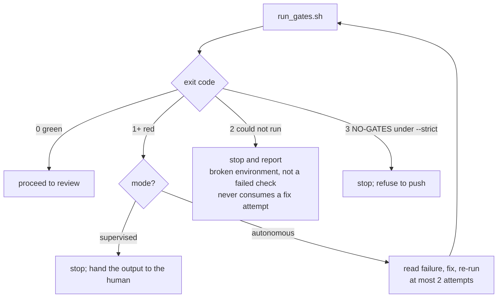

# The method

Why gantry is shaped the way it is. The [README](../README.md) covers what the commands do; this
covers the argument.

## The problem

An agent that both does the work and judges whether the work is done has no gate at all.

This is not a claim about model quality. It is structural. Ask any competent engineer to review
their own patch and they will catch less than a stranger would — not from dishonesty, but because
the reasoning that produced the code is the same reasoning now evaluating it. Every rationalisation
that let the bug in is still loaded. Models have this property too, and they have it worse, because
a model asked "are the tests passing?" can answer from what it *expects* rather than from what it
*ran*, and the answer reads identically either way.

The usual fix is to write a stronger instruction. *Always run the tests before pushing. Never push
red.* This does not work, and the reason it does not work is worth being precise about: **a prompt
is a request.** It competes with every other consideration in context — the user seemed in a hurry,
the failure looks unrelated, the change is obviously safe. Under enough pressure, a sufficiently
capable model will construct a defensible-sounding path around any sentence you write.

## The thesis

> **Model for judgment, script for the guarantee.**

Split the work by what each half is actually good at.

**Judgment** — what to build, how to structure it, which failure matters, whether this diff does
what the task asked — is open-ended, context-dependent, and has no decision procedure. That is the
model's half, and constraining it with rigid rules produces worse work, not safer work.

**Guarantees** are the opposite. "The test suite exited non-zero" is not a judgment; it is a fact,
it is cheap to establish, and it does not vary with how the question is phrased. Facts like that
belong in a script, and the script's output should be a number, not a paragraph.

So gantry has exactly one non-negotiable, and it is four lines of shell contract rather than four
paragraphs of prose.

## The contract is an integer

`run_gates.sh` returns an exit code. That is the whole interface.



An integer is the right shape here for a reason that took a while to see. A report can be
*interpreted*. A report says "2 tests failed, both in the legacy suite, unrelated to this change" —
and now there is a judgment call embedded in the gate, which is exactly what the gate exists to
remove. An exit code cannot be argued with. Either it is zero or it is not.

Three details in that diagram are load-bearing and non-obvious:

**Exit 2 is not a red check.** It means the gate could not run — bad invocation, not a git repo, a
broken environment. Treating it as a failure would spend an autonomous run's fix attempts trying to
repair a test suite that never executed. It stops the run instead, and says why.

**`NO-GATES` is fatal unattended but merely noted when watched.** A repo with no detectable checks
gets exit 0 under supervision — you are standing there, you can see there were no checks, you can
decide. Under `--autonomous` the same repo gets exit 3 and the run refuses to push. With nobody
watching, shipping code that ran zero checks is precisely the outcome the gate exists to prevent.

**The repo's own gate always wins.** If `.claude/gates.sh` exists, it *is* the gate and its exit
code is passed through verbatim. gantry's ecosystem auto-detection is a convenience for repos that
have not bothered yet — never an override of a repo that has.

## Why the gate had to leave the prompt

Everything above is still a rule the orchestrator *follows*. A skill body is prose, and prose is a
request. To make it a refusal, the check has to run somewhere the model does not control.

Claude Code's `Stop` hook is that place. It fires when the model tries to end its turn, and an exit
code of 2 blocks the stop and hands the model back its own failure.

```mermaid
sequenceDiagram
  participant M as Model
  participant H as Harness
  participant K as readiness-gate.sh
  participant G as run_gates.sh
  M->>H: "done — tests pass"
  H->>K: Stop hook
  K->>K: armed? task.md status implementing, .claude/gates.sh present
  K->>G: run the gate out of band
  G-->>K: exit 1 (red)
  K-->>H: exit 2 — block the stop
  H-->>M: you are not done; here is the failure
  M->>M: fix, then try to stop again
```

The difference between this and the inline call is the difference between a promise and a
mechanism. The inline `run_gates.sh` in `auto` and `factory` gives the orchestrator an exit code to
reason about and journal *before* the hook fires; the hook is what makes skipping it impossible.
Where both run and they disagree, **the hook wins.**

The hook holds **no state** — no attempt counter, no lock, nothing written to `task.md`. Its loop
termination is a single field, `stop_hook_active`, which the harness sets true on a stop that was
itself caused by a previous block. So the hook blocks a given stop at most once. The retry cap and
the `status: blocked` transition live in the orchestrator, where they belong.

## The honest limit

The hook arms on `task.md`'s `status: implementing`. That is a file the model can write.

So **"the model cannot bypass the gate" is approximately, not exactly, true.** A model that decided
to set `status: blocked` early would disarm its own gate. Nothing in the design prevents that.

Two reasons this is stated here rather than smoothed over. First, it is true, and a security
property you have overclaimed is worse than one you have scoped honestly — someone will eventually
find the gap, and it should be documented by the author rather than discovered by a stranger.
Second, the mitigation only makes sense once you have admitted the gap: **every invocation of the
hook, fire or skip, appends one line to `.claude/artifacts/gate-hook.log` with its reason.** A
bypass is not prevented; it is made visible after the fact. For a tool whose whole point is that
you can trust what it reports, an audit trail you can grep is worth more than a stronger claim you
cannot back.

## What we deleted

The first version of the readiness hook was 473 lines: an attempt counter, a lock file, per-task
keying, a fail-open matrix, a `mark_task_blocked` writer, an escalation path.

Two review rounds found **24 defects** in it. There were criticals in both rounds — and the second
round's criticals were *introduced by the first round's fixes*. A stale-lock steal that hot-spun
under `SIGKILL`. A classification bug that read `.claude/gates.sh`'s exit 2 as "unrunnable" and
would have waved a broken environment through forever.

The fix was not a third patch. It was deleting the state.

The shipped hook reads stdin, checks three conditions, runs one script, and exits 0 or 2. It is
inert unless armed, it holds nothing between invocations, and there is no lock to go stale because
there is no lock. Everything the state machine was for — the retry cap, the blocked transition —
moved to the orchestrator, which was already tracking the run and already journaling it.

The general lesson is the one that keeps recurring in agent tooling: **state in the enforcement
layer is where the bugs live.** The enforcement layer should be able to answer exactly one
question — is this tree provably good right now? — and answer it from scratch every time.

## Two contexts, one pipeline

`auto` and `factory` run the same stages. The difference is not capability; it is **context
budget**.

`auto` does everything in one context. Simple, portable, no coordination overhead, and the whole
run is visible in one transcript. For most tasks it is the right choice.

`factory` delegates exploring, planning, and implementing to scoped sub-agents against an on-disk
contract. It exists for one reason: an orchestrator that reads the files itself fills its context
with material it will never need again, and a full context is a stalled run. A sub-agent reads
10,000 lines and returns a paragraph. The paragraph is what the orchestrator needed.

The rule that follows, and the honest test of whether delegation earned its complexity: **never ask
an agent to show you a file; ask it for the answer.** Never paste an agent's raw material into
`task.md` or the journal; paste its summary. If you find yourself holding file dumps and raw logs,
delegation failed, and the run would have been cheaper as `/gantry:auto`.

## Handoff goes through disk

`factory` writes `task.md`, `plan.md`, and `journal.jsonl` to the worktree root. Not because
on-disk state is elegant, but because:

- **A contract written before the code is read cannot be quietly redefined by the plan.** `task.md`'s
  goal, acceptance criteria and how-to-verify are filled in *first*, from the task description, and
  the rest of the run is judged against them.
- **A reviewer needs the contract, not just the diff.** `task.md` and `plan.md` are committed, so
  the PR carries the thing it should be reviewed against.
- **A run survives a restart.** Context is lost constantly — compaction, a crash, a new session.
  Anything that only existed in the conversation is gone; anything on disk is not.

`plan.md` is the one artifact worth spending orchestrator context on, because you need it to brief
the implementer and to run the checkpoint.

## Where this is wrong

Stated plainly, because a tool that only lists its strengths is advertising:

- **The gate's arming condition is model-writable.** See "The honest limit" above.
- **`gantry-verifier` ships but is never dispatched.** The gate is a script, deliberately. The agent
  is there for callers who want a scoped read-only check-runner; wiring it into the pipeline is an
  open question, not a finished decision.
- **Auto-detection can false-green.** A repo whose real checks the heuristics cannot see gets
  `NO-GATES` — which, supervised, passes. `.claude/gates.sh` is the fix, and the report says so, but
  the default is permissive.
- **`NO-GATES` passing under supervision is a judgment call**, not an obviously correct one. The
  argument is that a human is present; the counter-argument is that humans skim.
- **Cross-references still rot.** Line-number citations are gone, but a section renamed in one file
  will silently orphan a pointer in another. `scripts/verify.sh` catches dead links, not stale prose.
